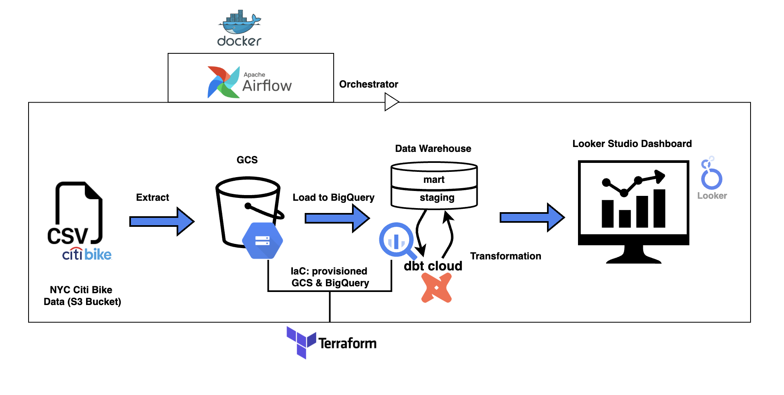
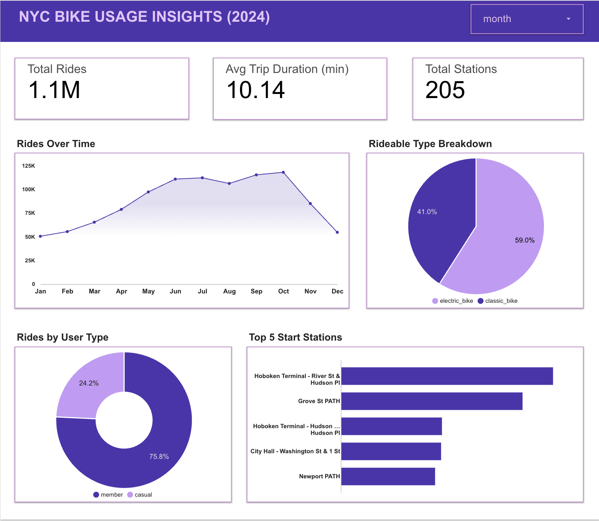

# NYC Bike Rides Pipeline 

## Overview

This project, developed as the final submission for the **DE Zoomcamp 2025 cohort**, builds an end-to-end batch data pipeline to process and analyze NYC Citi Bike trip data for 2024. The pipeline ingests raw trip data, stores it in a data lake(gcs), transforms it in a data warehouse, and visualizes key insights through a dashboard. The goal is to uncover trends in bike usage, rider behavior, and station activity to support urban mobility planning and optimize Citi Bike operations.

### Problem Statement

**Problem:** Citi Bike, New York City’s bike-sharing system, generates millions of trip records each month, capturing detailed ride data across 2024. Without an automated pipeline, it’s challenging to process these monthly datasets, extract meaningful patterns, and provide insights into rider behavior and system usage.

**Solution:** This project develops an end-to-end batch data pipeline to ingest Citi Bike 2024 trip data, store it in a data lake, transform it into a structured data warehouse, and visualize key metrics. By processing monthly trip files, the pipeline reveals trends in ride volume, bike type usage, and station activity, offering actionable insights for optimizing bike-sharing operations and understanding urban mobility patterns.

**Questions Answered:**
- How does Citi Bike usage vary over time throughout 2024, and what seasonal patterns emerge?
- What is the breakdown of rides between electric and classic bikes, and how does this impact system operations?
- How do ride patterns differ between member and casual users?
- Which stations are the most popular starting points for rides, and what does this suggest about urban mobility in NYC?
- What is the average trip duration, and how can this inform bike maintenance or rebalancing strategies?

### Technologies Used
- **Cloud:** Google Cloud Platform (GCP) for storage and data warehousing.
- **Infrastructure as Code (IaC):** Terraform to provision GCS buckets and BigQuery datasets.
- **Workflow Orchestration:** Apache Airflow (via Docker) for batch processing.
- **Data Lake:** Google Cloud Storage (GCS).
- **Data Warehouse:** Google BigQuery, with partitioned and clustered tables.
- **Transformations:** dbt Cloud for data modeling and transformations.
- **Visualization:** Looker Studio for the dashboard.


## Architecture

The pipeline follows a batch processing workflow, orchestrated end-to-end using Apache Airflow and built entirely on Google Cloud Platform with Infrastructure as Code:

1. **Data Ingestion:** Citi Bike 2024 trip data (CSV format) is downloaded from a [public S3 bucket](https://s3.amazonaws.com/tripdata/index.html) and uploaded to a Google Cloud Storage (GCS) bucket, named `naza_nyc_bike_rides`, which serves as the data lake.
2. **Orchestration:** Apache Airflow, containerized with Docker, orchestrates the monthly ingestion and processing pipeline.
3. **Data Warehouse:** Raw data was is loaded from GCS into Google BigQuery’s staging dataset (`nyc_bikes_staging`), with partitioning (by `started_at`) and clustering (by `start_station_id`) for optimization. After transformation, the data is loaded into the production dataset (`nyc_bikes_prod`).
4. **Transformations:** dbt Cloud is used to transform the raw data from the staging dataset into a production-ready dataset in BigQuery (`nyc_bikes_prod`), applying cleaning, aggregation, and modeling.
5. **Visualization:** Final datasets are visualized using Looker Studio, providing interactive dashboards to explore bike trip trends and insights such as total rides, rideable type breakdown, and top start stations.
6. **Infrastructure as Code (IaC):** The GCS bucket (`naza_nyc_bike_rides`) and BigQuery datasets (`nyc_bikes_staging` and `nyc_bikes_prod`) are provisioned using Terraform to ensure reproducibility and scalability. Use Terraform to provision the GCS  and  as Infrastructure as Code (IaC).

### Architecture Diagram



*Note:* The diagram illustrates the end-to-end flow, with Airflow orchestrating the pipeline, Terraform provisioning the infrastructure, and dbt Cloud handling transformations.

## Dashboard



The dashboard, titled **NYC Bike Usage Insights (2024)**, visualizes key metrics from the Citi Bike 2024 dataset:
- **Total Rides:** 1.1M rides in 2024.
- **Average Trip Duration:** 10.14 minutes.
- **Rides Over Time:** A line graph showing monthly ride volume, highlighting seasonal trends (e.g., peaks in summer).
- **Rideable Type Breakdown:** A pie chart showing 59.0% classic bikes vs. 41.0% electric bikes.
- **Rides by User Type:** A donut chart showing 75.8% member rides vs. 24.2% casual rides.
- **Top 5 Start Stations:** A bar chart listing the most popular stations (e.g., Hoboken Terminal - River St & Hudson Pl).

The dashboard is accessible via [Looker Studio link](https://lookerstudio.google.com/s/m_RrMM_TF20).

**Note: Records with null values in `started_at`, `rideable_type`, `ended_at`, or `start_station_name` have been excluded from the dataset.**

## Setup and Installation

### Prerequisites
- **GIT:** For cloning the repository
- **Google Cloud Platform (GCP):** A GCP project with billing enabled.
- **Terraform:** For provisioning infrastructure.
- **Docker:** For running Airflow locally.
- **dbt Cloud:** For data transformations.
- **Looker Studio:** For visualization.
- **GCP Credentials:** A service account key (JSON) with access to GCS and BigQuery.

### Repository Structure

```
nyc-citi-bike-pipeline/
├── dags/                    
│   └── etl.py
|   └── test_etl.py
├── terraform/    
│   └── main.tf
|   └── variables.tf
├── docker-compose.yml    
├── gcp_creds.json 
├── .env
├── .gitignore
└── README.md
```

### Steps to Run

1. **Clone the Repository**
   ```bash
   git clone https://github.com/ccinaza/nyc-bike-rides-pipeline.git
   cd nyc-bike-rides-pipeline
   ```

2. **Set Up GCP**
- Create a GCP project and enable the necessary APIs (Storage, BigQuery).
- Generate a service account key with permissions for GCS and BigQuery, and save it as gcp_creds.json in the project root.

3. **Provision Infrastructure with Terraform**
- Navigate to the terraform/ directory.
- Update variables.tf with your GCP project ID, region, and bucket name.
Run:
```bash
terraform init
terraform apply
```

4. **Set Up Airflow with Docker**
Create a .env file in the project root with the following variables:
```bash
DB_USER=airflow
DB_PASSWORD=airflow
DB_NAME=airflow
AIRFLOW_USERNAME=admin
AIRFLOW_PASSWORD=admin
AIRFLOW_EMAIL=your-email@example.com
AIRFLOW__WEBSERVER__SECRET_KEY=your-secret-key
GCP_PROJECT_ID=your-gcp-project-id
GCP_BUCKET_NAME=your-gcp-bucket-name
BIGQUERY_DATASET=your-bigquery-dataset
```

**Run Docker Compose:**
```bash
docker-compose up -d
```

5. **Run the Airflow DAG**
- The DAG (etl.py) is in the dags/ folder.
- The DAG includes a test script (`test_etl.py`) to validate the ETL process. Run the tests with:
  ```bash
  python dags/test_etl.py
  ```
- Access the Airflow UI at `http://localhost:8080` (default port) and log in with the credentials specified in your `.env` file (e.g., username: `admin`, password: `admin`).
- Trigger the DAG in the Airflow UI to download, upload, and load the 2024 Citi Bike data into BigQuery.

6. **Transform Data with dbt Cloud**
- Set up a dbt Cloud project connected to your BigQuery dataset (nyc_bikes_staging).
- Create dbt models to transform the raw data (e.g., clean timestamps, aggregate rides by month).
- Run the dbt models to populate the nyc_bikes_prod dataset.

7. **Visualize in Looker Studio**
- Connect Looker Studio to the nyc_bikes_prod dataset in BigQuery.
- Recreate the dashboard as shown above, or use the provided [Looker Studio link](https://lookerstudio.google.com/s/m9Oe3kIFNYQ).

8. **Clean Up Resources**
- To avoid incurring unnecessary GCP costs, destroy all remote resources when they are no longer needed by running:
```bash
terraform destroy
```

### Challenges and Learnings
- Challenge: Initially attempted to use Google Cloud Composer for Airflow but faced setup issues, so switched to a local Airflow instance via Docker.
- Learning: Gained hands-on experience with batch processing, Terraform for IaC, and optimizing BigQuery tables with partitioning and clustering.
- Insight: Seasonal trends (e.g., summer peaks) and station popularity (e.g., Hoboken Terminal) highlight the importance of data-driven urban planning.

## Future Improvements
- Implement a CI/CD pipeline for automated deployments.
- Explore streaming ingestion for real-time Citi Bike data.


### Acknowledgments
A huge thanks to Alexey Grigorev and the [DataTalksClub](https://github.com/DataTalksClub) team for providing this incredible opportunity through DE Zoomcamp 2025. I’m also grateful to the instructors and community for their guidance, and to Citi Bike for providing open trip data.

Feel free to reach out on [LinkedIn](https://www.linkedin.com/in/blessingangus/) or shoot me an email at blangus.c@gmail.com for questions or collaboration!